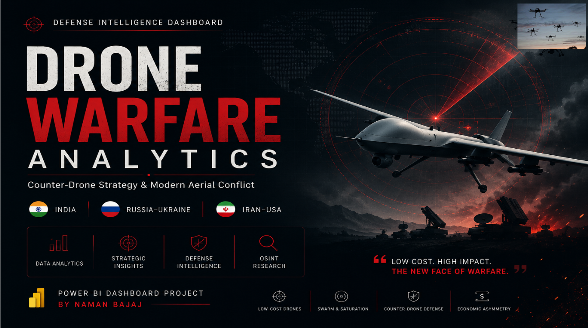
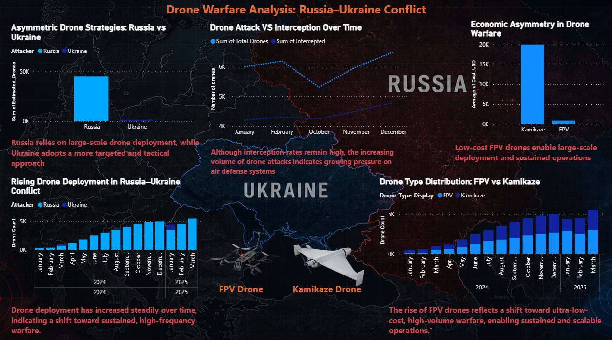
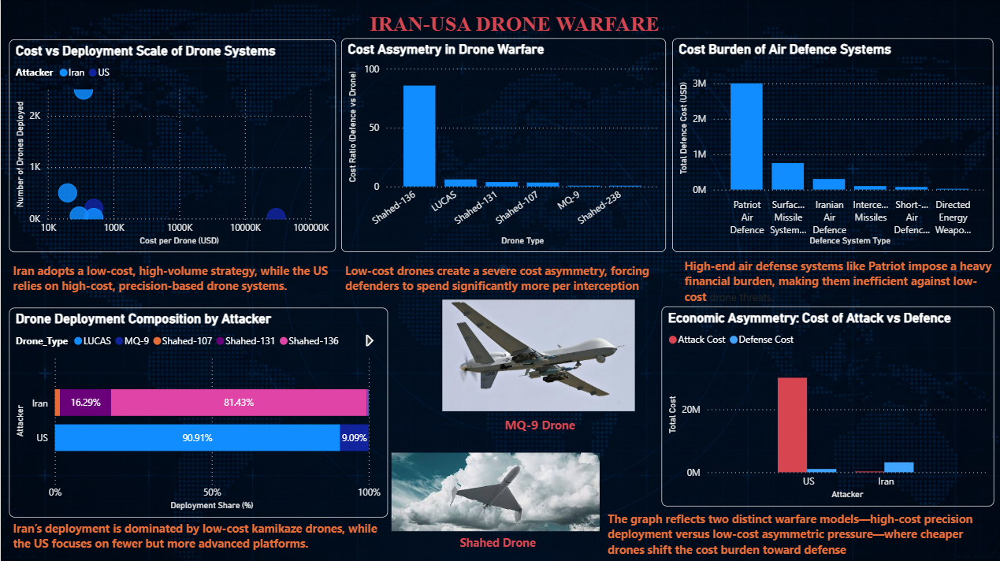
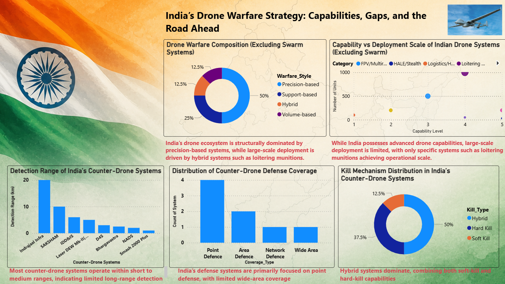

# 🚀 Drone Warfare Analytics  
### Counter-Drone Strategy & Modern Aerial Conflict Intelligence

> *“Low Cost. High Impact. The New Face of Warfare.”*

---

## 📌 Project Overview

This project is a **Power BI-based strategic defence intelligence dashboard** analyzing the rapid transformation of modern warfare through drones, swarm attacks, FPV systems, loitering munitions, and counter-drone defence architecture.

The analysis combines:
- 🇮🇳 India’s Drone & Counter-Drone Ecosystem
- ⚔️ Operation Sindoor
- 🇷🇺 Russia–Ukraine Drone Warfare
- 🇮🇷 Iran–USA Drone Warfare

The goal of this project is to understand:

- How drone warfare is changing military strategy
- Why low-cost drones create economic asymmetry
- How saturation attacks reduce interception efficiency
- Where India’s counter-drone capabilities are strong
- What scalability challenges emerge during sustained attacks

---

# 🧠 Core Strategic Questions

This project attempts to answer:

- Can modern air defence systems sustain high-volume drone attacks?
- Are low-cost FPV drones changing the economics of warfare?
- How effective are layered counter-drone systems under saturation pressure?
- Is future warfare shifting from platform-centric to attrition-based conflict?
- Where does India stand in modern drone warfare preparedness?

---

# 🛰️ Dashboard Architecture

## 1️⃣ India’s Drone Warfare Strategy
Analysis of:
- Drone warfare composition
- Capability vs deployment scale
- Counter-drone coverage distribution
- Kill mechanism distribution
- Detection range of Indian defence systems

### Key Insight
India possesses strong layered counter-drone capability, but operational deployment remains heavily concentrated in short-range point defence systems.

---

## 2️⃣ Operation Sindoor — Early Evidence of Modern Drone Warfare
A combat-oriented analytical slide focused on:
- Attack volume vs interception performance
- Interception efficiency across operational phases
- Saturation attack pressure
- Short-range defence dependence

### Key Insight
Interception efficiency declines significantly during saturation attacks, exposing scalability limitations in layered defence systems.

---

## 3️⃣ Russia–Ukraine Drone Warfare Analysis
Focused on:
- Large-scale drone deployment
- FPV vs Kamikaze drone evolution
- Economic asymmetry
- Sustained high-frequency attacks
- Interception pressure over time

### Key Insight
The Russia–Ukraine conflict demonstrates how scalable low-cost drone systems can sustain prolonged attritional warfare.

---

## 4️⃣ Iran–USA Drone Warfare
Analysis includes:
- Cost vs deployment scale
- Drone deployment composition
- Defence cost burden
- Cost asymmetry between attack and interception

### Key Insight
Cheap drones force defenders to spend disproportionately high amounts on interception and air defence infrastructure.

---

# 📊 Analytical Themes

## 🔻 Saturation Warfare
High-volume drone attacks reduce interception efficiency by overwhelming layered air defence systems.

---

## 💸 Economic Asymmetry
Low-cost drones create disproportionate economic pressure on expensive defence systems.

---

## 🛡️ Counter-Drone Defence
Modern defence increasingly depends on:
- Hybrid kill systems
- Electronic warfare
- AI-assisted detection
- Layered short-range interception

---

## ⚠️ Scalability Challenge
The key weakness in modern defence architecture is not capability — but sustained operational scalability.

---

# 🧾 Datasets Used

The project uses manually curated and standardized datasets based on:
- Public defence reports
- Open-source intelligence (OSINT)
- Strategic military analysis
- Publicly available operational estimates
- Defence capability assessments

### Included Data Areas
- Drone deployment estimates
- Interception rates
- Counter-drone systems
- Detection ranges
- Drone categories
- Cost asymmetry estimates
- Defence system classifications

---

# 🛠️ Tools & Technologies

| Tool | Purpose |
|------|----------|
| Power BI | Dashboard & Visualization |
| Excel | Data Cleaning & Standardization |
| DAX | Measures & Calculations |
| OSINT Sources | Defence Intelligence Research |

---
## Dashboard Preview

### Dashboard Overview
Interactive Power BI dashboard providing insights into global drone warfare activity, defense systems, and geopolitical conflict trends.



---

### Conflict & Regional Analysis
Comparative analysis of drone warfare activity across regions including Ukraine-Russia, Iran-USA, and India-focused defense datasets.




---

### Drone Category & Defense Systems
Visualization of drone categories, anti-drone technologies, interception systems, and operational patterns.



---

### Trend Analysis
Trend-based visualizations highlighting drone activity patterns, interception trends, and temporal conflict insights.


# 📂 Project Structure

```bash
drone-warfare-intelligence/
│
├── Dataset/
│   ├── DroneTypeCategory-Platforms-EstQuantityUnits-Notes.csv
│   ├── India_Anti_Drone_Standardized.xlsx
│   ├── India_Defence_Range_Data.xlsx
│   ├── India_Drone_Categories_Standardized.xlsx
│   ├── Interception Data.xlsx
│   ├── IranUsaDronewarfare.xlsx
│   ├── Operation_Sindoor_Drone_Dataset.xlsx
│   └── UkraineRussiaDrone.xlsx
│
├── dashboard-overview.png
├── interception-analysis.png
├── final-insights.png
├── india-drone-capability.png
├── iran-us-analysis.png
├── ukraine-russia-analysis.png
│
├── drone-warfare-dashboard.pbix
│
└── README.md
---

# 🎯 Key Strategic Insights

✅ Low-cost FPV and kamikaze drones are reshaping modern warfare.

✅ Saturation attacks significantly reduce interception efficiency.

✅ Counter-drone systems remain heavily short-range dependent.

✅ Hybrid soft-kill + hard-kill systems are operationally preferred.

✅ Economic asymmetry increasingly favours low-cost attackers.

✅ Future conflicts may prioritize scalable drone deployment over expensive platforms.

---

# 📌 Final Conclusion

Modern drone warfare is no longer defined solely by advanced aircraft or missile systems.

Instead, future conflicts are increasingly determined by:

- Scalability
- Cost efficiency
- Persistent drone pressure
- Layered electronic warfare
- Sustainable interception capability

> *“The future of warfare may belong not to the most expensive systems, but to the side capable of deploying intelligent, scalable, and economically sustainable drone operations.”*

---

# 👨‍💻 Author

### Naman Bajaj  
Power BI | Defence Analytics | Strategic Intelligence | Data Visualization

---
